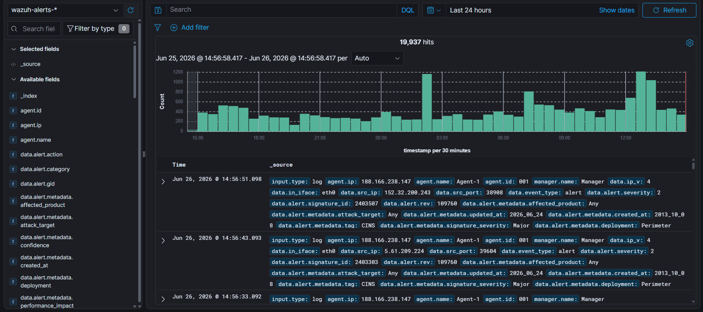
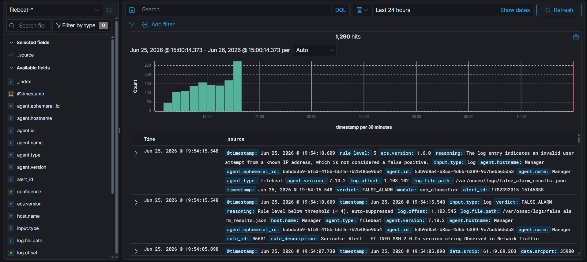
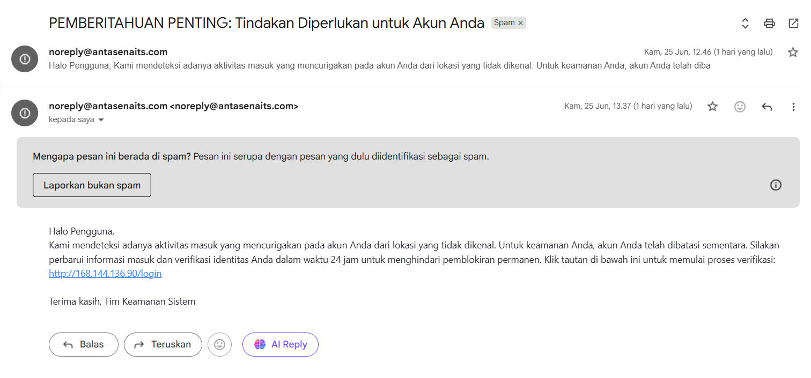
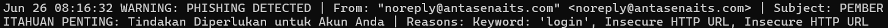
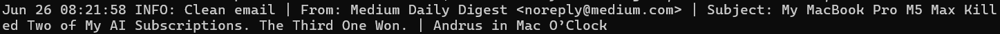

# Laporan Final Project SOC Kelas B

**Mata Kuliah:** Security Operations Center

**Kelompok:** 1 (Satu)

**Program Studi:** Teknologi Informasi, Institut Teknologi Sepuluh Nopember

## Anggota Kelompok
| Nama | NRP |
| :--- | :--- |
| Moch Rizki Nasrullah        | 5027241038 |
| Ivan Syarifuddin           | 5027241045 |
| Theodorus Aaron Ugraha      | 5027241056 |
| Ananda Fitri Wibowo         | 5027241057 |
| M. Alfaeran Auriga Ruswandi | 5027241115 |

## Pendahuluan
Proyek ini merupakan implementasi lingkungan pemantauan keamanan jaringan secara *real-time* yang difokuskan pada deteksi ancaman multi-vektor dan penyaringan peringatan keamanan (*alert fatigue mitigation*). Tidak hanya mengandalkan *ruleset* statis,  proyek SOC ini diintegrasikan dengan model *Artificial Intelligence* (AI) Qwen 2B untuk melakukan klasifikasi log lanjutan. Pendekatan ini memungkinkan sistem untuk membedakan antara ancaman nyata dan *false alarm* (positif palsu) secara otomatis.

## Infrastruktur Sistem
Lingkungan operasi dibangun menggunakan layanan *cloud* Digital Ocean yang terbagi menjadi tiga *Virtual Machine* (VM). Arsitektur ini dirancang terpisah (*decoupled*) antara pusat analitik dan *endpoint* pelaksana.

| Hostname | Alamat IP | Peran |
| :--- | :--- | :--- |
| **Manager** | `206.189.159.153` | SOC Center & AI Analyzer |
| **Agent-1** | `188.166.238.147` | Managed Endpoint 1 |
| **Agent-2** | `152.42.253.175` | Managed Endpoint 2 |

## Layanan Deteksi
Sistem ini secara aktif memantau dan menangani lima kategori ancaman atau layanan keamanan pada jaringan:
1. **Detection IDS Suricata:** Pemantauan anomali lalu lintas jaringan berbasis *signature*, mendeteksi aktivitas seperti pemindaian (*scanning*) atau protokol anomali (ICMP ping).
2. **Malware:** Pendeteksian berkas berbahaya pada sistem yang mencakup respons aktif (*active response*) untuk mengeksekusi skrip penanganan (misalnya `remove-threat.sh`).
3. **Shellshock:** Pemantauan terhadap upaya eksploitasi kerentanan eksekusi kode arbitrer pada layanan *web* (CVE-2014-6271).
4. **SQL Injection:** Deteksi aktivitas injeksi *query* berbahaya yang menargetkan kerentanan pada layanan basis data.
5. **Phishing:** Identifikasi upaya manipulasi psikologis berbasis *email* menggunakan *automated scanner*.

## Integrasi AI (Qwen 2B) & Klasifikasi *False Alarm*
Dalam lingkungan SOC, volume peringatan yang terlalu banyak dapat membebani analis keamanan. Oleh karena itu, seluruh peringatan diekspor ke dalam format JSON untuk dilatih dan dievaluasi oleh AI **Qwen 2B** yang bertindak sebagai modul `soc_classifier`. 

Klasifikasi ancaman ditentukan melalui ambang batas (*threshold*) tingkat keparahan (*rule_level*):
* **Level ≤ 4 (Auto-Suppressed):** Sistem menganggap *alert* tersebut tidak memiliki risiko yang memadai dan langsung melabelinya sebagai `FALSE_ALARM`.
* **Level ≥ 5 (AI Analyzed):** *Alert* diteruskan ke model Qwen 2B untuk dianalisis lebih dalam. Model akan mengevaluasi *log context* (seperti IP asal, waktu kejadian, eskalasi hak istimewa, pergerakan lateral, dll.) sebelum memberikan *verdict* akhir.

### Analisis Klasifikasi pada Layanan

Berikut adalah hasil evaluasi sistem dan AI Qwen 2B terhadap 5 layanan keamanan yang diimplementasikan:

**1. Detection IDS Suricata**

> **Penjelasan:** Log menunjukkan adanya aktivitas ping (`Suricata: Alert - GPL ICMP_INFO PING *NIX`) dengan Rule ID `86601`. Karena tingkat peringatan ini tergolong sangat rendah (`rule_level: 3`), sistem tidak perlu melibatkan AI. Modul `soc_classifier` secara otomatis meredam log ini (`Rule level below threshold (< 4), auto-suppressed`) dan melabelinya sebagai `FALSE_ALARM`.

**2. Malware**

> **Penjelasan:** Gambar di atas menunjukkan log dari tindakan sistem (`Active response: active-response/bin/remove-threat.sh - add`) dengan Rule ID `657`. Karena ini merupakan pencatatan aksi respons rutin dan hanya memiliki `rule_level: 3`, sistem langsung mengklasifikasikannya sebagai `auto-suppressed` dengan *verdict* `FALSE_ALARM` tanpa perlu analisis AI lebih lanjut.

**3. Shellshock**

> **Penjelasan:** Terdapat peringatan tingkat kritis (`rule_level: 15`) dengan deskripsi `Shellshock attack detected` (Rule ID `31168`). Karena levelnya di atas 4, AI Qwen 2B ditugaskan untuk menganalisis konteks log. AI menyimpulkan *verdict* `FALSE_ALARM` karena tidak menemukan indikator berbahaya lanjutan pada sistem, seperti IP asal yang mencurigakan, aktivitas di luar jam kerja, eskalasi hak istimewa, pergerakan lateral, maupun indikasi eksfiltrasi data.

**4. SQL Injection**

> **Penjelasan:** Log mencatat `SQL injection attempt.` (Rule ID `31103`) dengan tingkat keparahan menengah (`rule_level: 7`). AI menganalisis konteks serangan ini dan memberikan *reasoning* bahwa tidak terdapat jejak anomali lebih lanjut (seperti keberhasilan injeksi, eksfiltrasi data, atau eskalasi hak istimewa pengguna). Oleh karena itu, AI secara cerdas menyaring peringatan ini sebagai `FALSE_ALARM`.

**5. Phishing**

> **Penjelasan:** Peringatan `Phishing email detected by automated scanner.` (Rule ID `100207`) memiliki tingkat keparahan tinggi (`rule_level: 12`). Meski memicu alert tinggi, evaluasi AI Qwen 2B menyatakan bahwa ini adalah `FALSE_ALARM`. Alasannya adalah log tersebut tidak berkolerasi dengan aktivitas mencurigakan lainnya di dalam *host*, seperti eksekusi *malware*, percobaan *brute-force*, atau kompromi akun yang biasanya mengikuti sebuah serangan *phishing*.

## SOAR Service (Python Script)

Untuk menjalankan AI dan Phising Detection Alertnya, kami menggunakan 2 custom-build service yang kami jalankan, yaitu `soc-classifier.service` dan `wazuh-phising.service`. 

### soc-classifier.service

Service ini digunakan untuk menjalankan script python yang kami gunakan untuk mendeteksi false positive dan non false positive, berikut adalah isi dari file ini

```bash
[Unit]
Description=SOC False Alarm Classifier
After=network.target wazuh-manager.service

[Service]
Type=simple
User=root
ExecStart=/usr/bin/python3 /var/ossec/integrations/false_alarm_classifier.py
Restart=on-failure
RestartSec=10
StandardOutput=journal
StandardError=journal

[Install]
WantedBy=multi-user.target
```

Service ini berfungsi untuk menjalankan script python AI kami di background selayaknya sebuah file service biasa yang terus berjalan. File ini berfungsi agar log dari file `alerts.json` dari SIEM diambil dan diberikan kepada model AI secara live dan AI memberikan **verdict** sesuai dengan konteks yang diberikan secara streaming langsung.

File ini yang membuat parameter benchmark kami dapat terlihat dalam 2 jenis dashboard yang berbeda. Selain pada **index pattern** default yang ada dalam Wazuh, kami juga membuat sebuah **index pattern custom** yang memuat semua alert yang sama dengan index pattern default, yaitu `wazuh-alerts-*` dan memasukkannya ke dalam index pattern yang kami buat secara custom bernama `filebeat-*`. Fungsi index pattern custom ini adalah untuk memberikan gambaran baru mengenai alerts yang sudah difilter oleh AI kami.

Tampilan index pattern default:



Dalam index pattern ini, hanya diperlihatkan data-data raw yang belum dicerna oleh AI. Sedangkan, index pattern baru kami dapat memperlihatkan data-data yang sudah diproses lewat AI:

Tampilan index pattern custom:



Singkatnya, kami mengambil data raw dari dashboard pertama (index pattern default) dan memberikannya ke AI untuk diproses. Setelah AI kami selesai memproses data rawnya, maka data processed akan dimasukkan ke dalam index pattern custom dengan variabel yang telah dibuat untuk mendeteksi adanya sebuah false positive.

### wazuh-phising.service

Seperti pada namanya, service ini digunakan untuk memfilter email yang didapatkan dari email yang bersangkutan. Disini saya menggunakan email pribadi saya sendiri yaitu `theodorusaaron31@gmail.com`. Setiap email yang masuk ke dalam email pribadi saya akan masuk ke dalam sebuah file log bernama `data-email.log` dan service akan menjalankan sebuah script python untuk mengecek tiap-tiap log yang masuk dan menentukan apabila itu adalah sebuah serangan phising atau tidak.

isi dari service ini adalah seperti berikut:

```bash
[Unit]
Description=Wazuh Automated Email Phishing Detector Service
After=network.target

[Service]
Type=simple
ExecStart=/root/wazuh-phishing/venv/bin/python3 /root/wazuh-phishing/email_phishing_detector.py
Restart=always
Restart=always
RestartSec=10
StandardOutput=syslog
StandardError=syslog
SyslogIdentifier=wazuh-phishing

[Install]
WantedBy=multi-user.target
```

Pada kode tersebut, kami menjalankan sebuah script pythin yang berisikan sebuah AI untuk mengecek log email dan menentukan apakah email tersebut termasuk phising atau tidak.

Untuk mengetahui apakah email tersebut adaalah sebuah phising, kami menyetel AI kami untuk mengecek tiap-tiap bagian dari semua email seperti berikut:
1. Sender: Siapa yang mengirimkan email ini, apakah email official atau bukan. Jika ya, maka akan otomatis dicatat sebagai `Clean Email`. Jika tidak, maka akan lanjut dengan pengecekan Header Emailnya.
2. Header: Apa subject yang diinginkan oleh sender untuk receiver lakukan. Disini kami membuat sebuah library kata yang sangat awam digunakan dalam email phising, seperti `urgent`, `hacked`, `alert`, dan sebagainya. Semakin banyak kata ini, maka semakin tinggi **confidence score** AI untuk menentukan ini adalah sebuah phising.
3. Body: AI akan melihat apa saja isi konten dari email yang dikirim, apakah ada sebuah link URL, atau sebuah dokumen. Jika terdapat sebuah URL dalam email tersebut, maka akan mengaktifkan library python `beautiful soup` untuk mengakses dan menscraping dari URL tersebut dan memberikan hasil berupa file html ke AI.
4. Document: Jika terdapat sebuah dokumen dalam email tersebut, maka akan dilakukan pengecekan jenis file terlebih dahulu. AI kami untuk saat ini hanya akan mengecek file bertipe **excutabl** atau `.exe` agar langusng di reverse engineer dan ditentukan apakah itu malware atau tidak.

Contoh Email Phising rekayasa yang dikirimkan:



> *Notes: Email ini bersifat palsu dan hanya sekedar rekayasa!

Dan ini adalah alerts yang masuk ke dalam file lognya:



Dapat dilihat bahwa terdapat 2 jenis reasoning yang muncul, yaitu terdapat keyword yang menandakan sebuah alert phising (meningkatkan confidence score) yang sudah disebutkan sebelumnya untuk pengecekan header email dan alert **Insecure HTTP URL**, yaitu alert yang muncul dikarenakan sebuah URL yang dicantumkan masuk ke dalam email berupa UTL yang tidak secure (HTTP). Jadi meskipun sender nya valid (Email resmi antasena ITS), AI masih akan tetap mengecel email tersebut secara keseluruhan.

Tampilan jika outputnya `Clean Email`:



Dalam email clean tersebut, AI mendeteksi sender yang valid (Medium.com), header yang hanya berupa sebuah notifikasi sebuah headline news baru di Medium, dan tidak ada konten yang dicantumkan selain teks, jadi sangat kecil kemungkinan phising dari email ini dan akhirnya dilabeli sebagai `Clean Email`.

## Benchmark & Reduksi Alert
Penerapan *soc_classifier* menggunakan Qwen 2B memberikan efisiensi yang masif terhadap lingkungan pemantauan. Berikut adalah hasil *benchmark* dari implementasi tersebut:

**1. Before**

**2. After**


* **Total Alerts Sebelum AI:** 12.211 alerts
* **Total Alerts Sesudah AI:** 3.190 alerts
* **Total Alerts yang Direduksi:** 9.021 alerts

**Persentase Reduksi:**
Sistem berhasil mengurangi *noise* peringatan sebesar **73.88%**. Penurunan drastis ini mengoptimalkan beban kerja tim *Security Operations*, memastikan bahwa investigasi dan triase hanya difokuskan pada sisa 26.12% peringatan yang telah tersaring oleh kecerdasan buatan.

## Kendala dan Solusi
Dalam proses pengerjaan proyek ini, kami mengalami kendala teknis terkait implementasi sistem *Security Orchestration, Automation, and Response* (SOAR). Ketentuan penugasan mengarahkan penggunaan **Shuffle** sebagai alat orkestra keamanan. Namun, kami sempat mencoba mengeksplorasi layanan SOAR berbasis *cloud* dari **Microsoft Azure**. Kendala utama muncul pada tahap otorisasi, dimana akun Azure *Education* memiliki batasan *privilege* terhadap penggunaan layanan keamanan tingkat lanjut dan memerlukan eskalasi izin dari administrator pusat. 

Sebagai solusi atas keterbatasan akses tersebut, kami memutuskan untuk mengimplementasikan fungsionalitas SOAR sebagai sebuah layanan (*service*) yang berjalan langsung di dalam *Virtual Machine* (VM). Pendekatan ini kami pilih untuk menggantikan ketergantungan pada platform *end-to-end* eksternal maupun Shuffle, serta karena permasalahan izin administrasi yang sudah disebutkan sebelumnya. Dengan menjalankan SOAR sebagai *service* internal, proses orkestrasi keamanan, penanganan *alert*, dan klasifikasi ancaman oleh AI tetap dapat tereksekusi secara mulus dan terpusat di dalam infrastruktur lokal yang telah dibangun.

## Saran dan Pengembangan
Untuk penyempurnaan sistem pemantauan keamanan ini di masa mendatang, terdapat beberapa aspek krusial yang dapat diekspansi:
1. **Implementasi Shuffle SOAR:** Mengadopsi platform Shuffle secara penuh sesuai dengan ketentuan awal proyek. Penggunaan Shuffle akan memberikan fleksibilitas dalam menyusun *playbook* penanganan insiden tanpa terikat oleh restriksi lisensi akun edukasi seperti pada layanan *cloud* komersial.
2. **Peningkatan Kapabilitas AI:** Mengembangkan fungsionalitas model AI Qwen 2B agar tidak terbatas pada klasifikasi *false alarm*. AI diharapkan dapat diintegrasikan dengan modul respons untuk mengambil tindakan aktif atau eksekusi otonom, seperti memberikan perintah dan atau pilihan blokir (*block*) terhadap IP penyerang di level *firewall*, melakukan karantina file, atau mengisolasi *host* yang terkompromi.

## Kesimpulan
Implementasi *Security Operations Center* (SOC) menggunakan arsitektur *Virtual Machine* terisolasi pada Digital Ocean telah berhasil membangun lingkungan pemantauan keamanan jaringan yang proaktif. Sistem ini terbukti mampu mendeteksi secara *real-time* lima vektor ancaman utama: anomali jaringan (Suricata IDS), *malware*, eksploitasi Shellshock, SQL *Injection*, serta serangan *phishing*.

Inovasi utama dalam proyek ini adalah integrasi kecerdasan buatan (Qwen 2B) sebagai analis lapis pertama. Penerapan klasifikasi ambang batas tingkat keparahan (*severity threshold*) dan analisis konteks ancaman secara cerdas berhasil memitigasi fenomena *alert fatigue*. AI terbukti sukses mereduksi volume peringatan keamanan positif palsu (*false alarm*) secara drastis hingga **73,88%** (dari 12.211 menjadi 3.190 peringatan). Secara keseluruhan, proyek ini tidak hanya memvalidasi efektivitas deteksi sistem keamanan, tetapi juga mendemonstrasikan efisiensi operasional yang esensial bagi analis keamanan siber.
